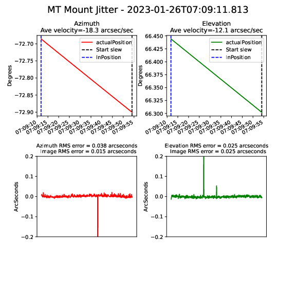
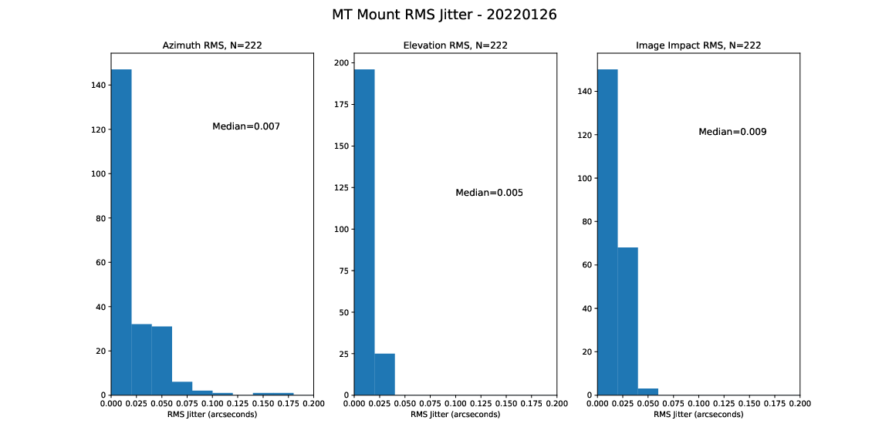
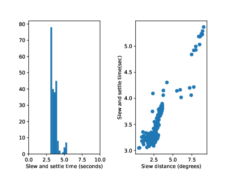

:tocdepth: 1

.. sectnum::

.. Metadata such as the title, authors, and description are set in metadata.yaml

.. TODO: Delete the note below before merging new content to the main branch.

Abstract
========

During one of the soak tests during the night of 26-Jan-2023, the soak program ran for almost 3 hours.  During this time, there were about 220 tracking intervals.  This note details the analysis that was done on this run, including mount jitter and slew and settle times.

NOTE:  An earlier version of this technote had a timebase error which resulted in erroneous conclusions.  Simply, I was using the wrong timestamp for the inPosition values, which caused me to pair up the inPosition timestamp with the wrong start_slew timestamp.  This error has been corrected in this version, and the results are much better. 

Methodology
================

The soak program runs by slewing a random amount, and then tracking for approximately 30 seconds, then repeating the cycle.  The tracking data was analyzed by querying the summit EFD to determine the times of the beginning of the slew and the times when the axes were in position.  The beginning of the slew was determined by looking for abrupt changes in the lsst.sal.MTMount.command_trackTarget.azimuth and lsst.sal.MTMount.command_trackTarget.elevation variables.  The in position time was determined to be the latest of the lsst.sal.MTMount.logevent_elevationInPosition.inPosition and lsst.sal.MTMount.logevent_azimuthInPosition.inPosition timestamps.  The notebook that did this analysis and made the plots in this technote is available at:
https://github.com/craiglagegit/Notebook_Keeper/blob/main/summit_notebooks/MTMount_Characterization_3_27Jan23.ipynb

Figure 1 shows a portion of the soak test, showing the azimuth slew and track data. The dotted black lines indicate the beginning of the slew.  The dotted blue lines are the inPosition time stamps.

.. image:: ./_static/Slew_Track_Example_Corrected.png

Figure 1.  A portion of the soak test, showing the azimuth slew and track data. The dotted black lines indicate the beginning of the slew.  The dotted blue lines are the inPosition time stamps.

Mount jitter plots
====================

To analyze the mount jitter, we use a procedure which has proven successful on other telescopes.  The telemetry data during the tracking phase is fit with a fourth order polynomial, and the jitter is defined as the deviation of the telemetry from this smooth curve.  A typical plot is shown in Figure 2.  These plots are available for each tracking period during the test, with the plots labeled by the inPosition timestamp.  Figure 3 shows a histogram of the mount jitter values. Virtually all tracking intervals easily meet the 0.01 arcsecond spec.  A few of these are impacted by single anomalous values as seen in Figure 2.  It is not physically possible for the mount to move fast enough to cause those "glitches", so these must be anomalous values from the encoder stream.

Figure 2.  A typical mount jitter plot.  The Image RMS error includes the cos(Elevation) factor in the azimuth data.

Figure 3.  Histograms of the mount jitter data for the 200+ tracking periods during the run.  The rightmost "Image Impact" plot is the RMS of the Az and El values, with the azimuth jitter value scaled by cos(elevation).  

Slew and Settle times
==========================

By taking the difference from the inPostion timestamp and the Start slew timestamp, we can characterize the slew and settle times.  This is shown in Figure 4.  Slews of less than 3.5 degrees have slew and settle times less than 4 seconds.

Figure 4.  Slew and settle times.  The left hand plot shows a histogram of the times, and the right hand plot shows the slew and settle times plotted against slew distance.

Summary
==========================

This technote shows a summary of the TMA performance during a 3 hour soak test during the night of 26-Jan-23.  The data looks quite good, and only one minor problem was identified.

#. There are occasional anomalous values in the encoder stream.  These impact the calculated jitter values.  If these cannot be eliminated, perhaps they can be filtered out, either from the encoder stream or from this analysis.

